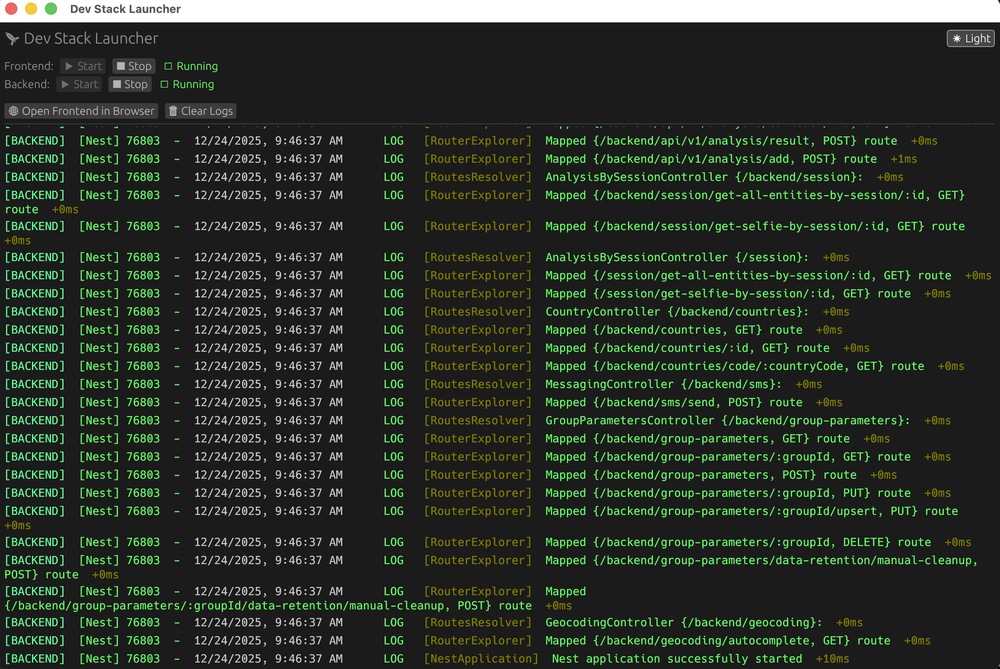

#  Dev Stack Launcher


> **The ultimate developer companion for the Datakeen stack.**
> Stop juggling multiple terminal windows. Manage your full-stack environment from a single, beautiful native interface.

---

##  Preview



---

##  Features

###  Unified Control Center

Start, stop, and restart your **Frontend** (Vite) and **Backend** services independently with a single click. No more `Ctrl+C` confusion.

###  Rich Visual Terminal

Integrated log viewer with **full ANSI color support** and advanced filtering capabilities.

- **Real-time streaming** logs with Unicode font support (Noto Sans Mono)
- **Smart filtering**: Filter by source (Frontend/Backend/System) and level (Normal/Error)
- **Advanced search** (VSCode-style):
  - Case-insensitive text search with highlighting
  - Match counter (X/Y occurrences)
  - Navigate between matches with ▲▼ buttons
  - Auto-scroll to current match
- **Error highlighting** with distinct colors
- **Auto-scroll** to keep up with new logs
- **Copy to clipboard** for filtered logs
- **Word wrap** for long lines
- Clear separation between system, frontend, and backend logs

###  Smart Integration

- **Auto-Discovery**: Automatically detects running ports and magic links (e.g., from Vite).
- **One-Click Open**: Launch your browser directly to the correct local URL.
- **Graceful Shutdown**: Handles process groups correctly (`SIGTERM`/`SIGKILL`) ensuring no zombie processes are left behind.

###  Beautiful UI

- Built with **egui** for high-performance native rendering.
- **Dark/Light Mode** support with adaptive colors (defaulting to Dark ).
- Clean, modern aesthetics.

---

##  Architecture & Tech Stack

Refactored in 2025 to follow modern Rust best practices, the codebase is modular and robust:

| Module        | Description                                                               |
| ------------- | ------------------------------------------------------------------------- |
| **`app`**     | UI logic and state management via `eframe`.                               |
| **`process`** | Low-level process supervision with cross-platform support (Unix/Windows). |
| **`logs`**    | High-performance ANSI escape sequence parsing and buffer management.      |
| **`error`**   | Centralized error handling system.                                        |

Built with:

- **[Rust](https://www.rust-lang.org/)** - For safety and performance.
- **[Eframe/Egui](https://github.com/emilk/egui)** - Immediate mode GUI framework.
- **[Tokio](https://tokio.rs/)** - Asynchronous runtime for non-blocking I/O.

---

##  Roadmap

- [x] **Log Filtering**: ✅ Filter logs by level (Normal/Error) and source (Frontend/Backend/System)
- [x] **Advanced Search**: ✅ VSCode-style search with highlighting and navigation
- [ ] **Git Operations Tab**: A dedicated tab for common git workflows.
- [ ] **Branch Management**:
  - [ ] Create new branches.
  - [ ] Checkout existing branches.
- [ ] **Quick Pull**: One-click pull for main branches (`dev`, `staging`, `main`).
- [ ] **Commit Interface**: Button to stage and commit changes with a message input.
- [ ] **Push Button**: Sync your local changes to the remote repository.

---

##  Getting Started

### Prerequisites

- Rust & Cargo (latest stable)
- Node.js & pnpm (for the actual stack)

### Running the Launcher

```bash
# Navigate to the gui directory
cd rust-gui

# Run in development mode
cargo run

# Build for release
cargo build --release
```

---

##  Troubleshooting

**"Port already in use"**
The tool attempts to gracefully kill process groups. If a process persists, check:

```bash
lsof -i :3000 # or :5173
kill -9 <PID>
```
